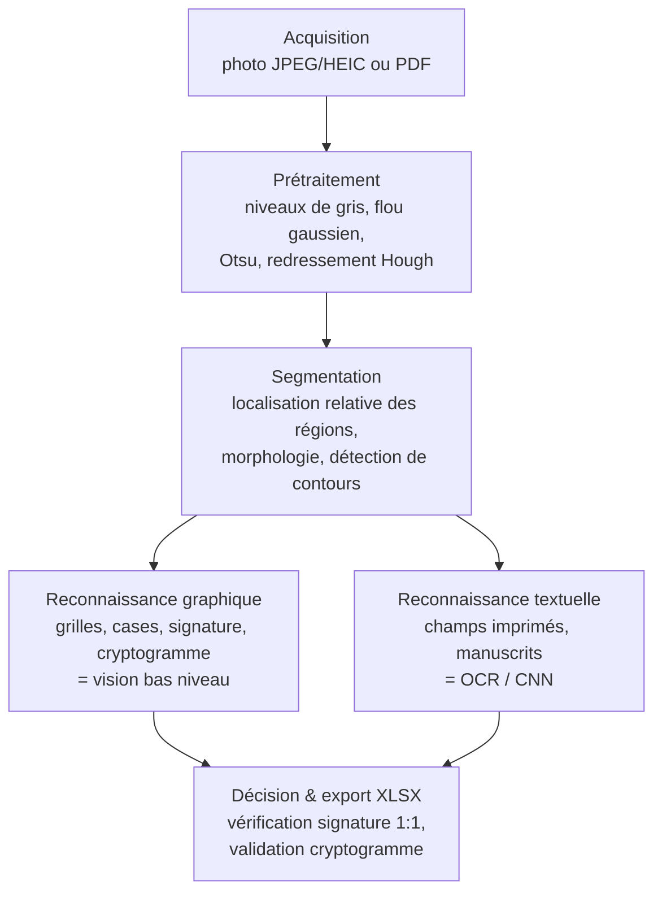

# DeepForm — Lecture automatique de formulaires d'examen semi-structurés

**Projet IG.2405-2026 — Vision par ordinateur**

*Rapport scientifique*

---

## 1. Position du problème

La société fictive **DeepForm** souhaite automatiser la lecture de formulaires
d'examen semi-structurés. Un formulaire est dit *semi-structuré* car sa mise en
page est connue a priori (grilles, cases à cocher, encadrés réservés à
l'écriture), mais son contenu — chiffres et signatures manuscrits, texte
imprimé, croix — est variable et bruité par le mode d'acquisition (photographie
au smartphone ou numérisation PDF).

Le projet se décompose en deux programmes :

- **`autoValidPresences`** : à partir de *photographies* de feuilles de présence,
  lire l'identifiant étudiant (grille à bulles) et **authentifier la signature**
  manuscrite, afin de produire une feuille de présence validée.
- **`autoReadForm`** : à partir de formulaires d'examen *numérisés au format PDF*,
  extraire les champs d'identité (page 1), les réponses aux questions (cases à
  cocher, valeurs numériques), et vérifier la cohérence du **cryptogramme**
  présent en pied de chaque page.

Le défi central est la **lutte contre l'usurpation d'identité** : un étudiant
pourrait inscrire l'identifiant d'un camarade absent et signer à sa place. Le
système doit donc non seulement *lire* mais aussi *vérifier* que la signature
correspond bien à l'identité revendiquée. Cette double exigence — lecture +
authentification — structure l'ensemble de nos choix méthodologiques.

Une **contrainte forte** du cahier des charges (§4.1) gouverne ces choix : les
**éléments graphiques** (grilles, cases, signatures, cryptogrammes) doivent être
traités **exclusivement** par des méthodes de **vision bas niveau** (filtrage,
seuillage, transformée de Hough, morphologie mathématique, rotations). Seul le
**texte** imprimé ou manuscrit peut recourir à des outils de plus haut niveau
(OCR Tesseract, réseaux de neurones). Nous démontrons dans ce rapport comment
chaque traitement respecte cette frontière.

---

## 2. État de l'art (succinct)

La **transformée de Hough** [1] reste l'outil de référence pour détecter droites
et lignes dans une image de contours ; nous l'employons pour estimer
l'inclinaison du document. La **morphologie mathématique** [2], formalisée par
Serra, fournit les opérateurs d'érosion, dilatation, ouverture et fermeture
utilisés pour isoler les bordures de cellules et le bruit poivre-et-sel. Le
**seuillage d'Otsu** [3] choisit automatiquement un seuil de binarisation en
maximisant la variance interclasse.

Pour la description de signatures, le descripteur **HOG** (histogramme de
gradients orientés) de Dalal & Triggs [4] capture la structure locale des
traits ; les **moments invariants de Hu** [5] fournissent sept invariants à la
translation, l'échelle et la rotation ; les **profils de projection** [6] sont
un descripteur classique en analyse de documents. La vérification de signatures
hors-ligne [7] distingue les scénarios de **vérification 1:1** (authentifier une
identité revendiquée) et d'**identification 1:N** (retrouver l'auteur parmi N).
Enfin, le moteur **Tesseract** [8] et les **réseaux convolutifs** type LeNet [9]
constituent l'état de l'art pour la reconnaissance de texte et de chiffres
manuscrits, autorisés ici uniquement sur la composante textuelle.

---

## 3. Description des méthodes

Le système suit un **pipeline fonctionnel** en quatre étages, commun aux deux
programmes :

### 3.1 Prétraitement

Soit $I(x,y)$ l'image couleur acquise. On la convertit en niveaux de gris
$g = 0.299R + 0.587G + 0.114B$, puis on applique un **flou gaussien** $3\times3$
pour atténuer le bruit capteur :
$g_\sigma = g * G_\sigma$, où $G_\sigma$ est le noyau gaussien.

La **binarisation d'Otsu** sélectionne le seuil $t^\*$ qui maximise la variance
interclasse :

$$
t^\* = \arg\max_{t}\; \sigma_b^2(t),\qquad
\sigma_b^2(t) = \omega_0(t)\,\omega_1(t)\,\big[\mu_0(t)-\mu_1(t)\big]^2,
$$

où $\omega_0,\omega_1$ sont les probabilités cumulées des deux classes
(fond/encre) et $\mu_0,\mu_1$ leurs moyennes d'intensité.

Le **redressement** (deskew) corrige l'inclinaison du document. On extrait les
contours par Canny, puis la **transformée de Hough** retourne un ensemble de
droites paramétrées par $(\rho,\theta)$. Pour chaque droite on calcule l'angle
$\alpha_i = \theta_i - 90°$ et on retient les droites quasi-horizontales
($|\alpha_i| < 45°$). L'angle de correction est la **médiane** de ces angles,
robuste aux droites parasites :

$$
\hat{\alpha} = \mathrm{median}\{\alpha_i : |\alpha_i| < 45°\}.
$$

L'image est ensuite tournée de $-\hat{\alpha}$ autour de son centre. Les photos
sont préalablement redimensionnées à une hauteur standard de 2000 px.

### 3.2 Lecture des grilles à bulles (StudentID, Group)

L'identifiant étudiant est codé sur une grille de **5 colonnes × 10 lignes**
(chiffres 0–9), le groupe sur 2 colonnes de chiffres + 1 colonne de lettres
(A–J). La mise en page étant fixe, chaque grille est **localisée par coordonnées
relatives** à la taille de l'image (fractions de largeur/hauteur), ce qui évite
toute détection coûteuse et reste cohérent entre photo et PDF.

Dans chaque cellule, la marque utile (croix « X » manuscrite) est noyée parmi
les **bordures imprimées** de la case. On les retire par **ouverture
morphologique** avec des éléments structurants linéaires. L'ouverture est définie
par $\gamma_B(f) = \delta_B\big(\varepsilon_B(f)\big)$, composition d'une érosion
$\varepsilon_B$ puis d'une dilatation $\delta_B$ par l'élément $B$. Avec un
élément horizontal $B_h$ (longueur $\approx 0{,}55\,w_{cell}$) et vertical $B_v$,
on isole les traits droits longs (bordures), puis on les soustrait :

$$
M = \mathrm{inv}(f) \;-\; \big[\gamma_{B_h}(\mathrm{inv}(f)) + \gamma_{B_v}(\mathrm{inv}(f))\big],
$$

de sorte que $M$ ne contient plus que les **traits obliques** de la croix. Pour
chaque cellule $(r,c)$ on mesure le **taux de remplissage** :

$$
\phi(r,c) = \frac{\#\{p \in \text{cellule}_{r,c} : M(p) > 0\}}{|\text{cellule}_{r,c}|}.
$$

La ligne marquée d'une colonne est obtenue par **argmax**, avec un double critère
de validité (seuil absolu et seuil relatif à la médiane de la colonne) pour
rejeter les colonnes vides ou ambiguës :

$$
r^\*(c) = \arg\max_r \phi(r,c),\quad
\text{retenu si } \phi(r^\*,c) > 0{,}02 \text{ et } \phi(r^\*,c) > 2\,\widetilde{\phi}(c).
$$

La même méthode (suppression morphologique des bords puis mesure de remplissage)
est appliquée au StudentID, au numéro de groupe et aux QCM du formulaire. Aucune
détection automatique de rectangles ou de cases cochées n'est employée : toutes
ces opérations relèvent strictement de la vision bas niveau (filtrage,
morphologie, projections), conformément aux consignes §4.1.

### 3.3 Vérification de signature

La région de signature est extraite de sa zone relative fixe, puis recadrée
serré sur l'encre au moyen des **profils de projection** (sommes de pixels par
ligne et par colonne) du tracé binarisé — une opération bas niveau, sans
détection de rectangle. L'intérieur est **normalisé** : seuillage adaptatif gaussien
(robuste à l'éclairage non uniforme des photos), nettoyage par ouverture
morphologique, recadrage serré sur la boîte englobante des pixels d'encre, puis
redimensionnement à $128\times64$.

Trois **descripteurs complémentaires** sont extraits.

**HOG** — on calcule les gradients $g_x, g_y$ (Sobel), leur magnitude et
orientation $(m,\theta)$, et un histogramme d'orientations sur 8 secteurs pondéré
par la magnitude :

$$
H[k] = \sum_{p\,:\,\theta(p)\in \text{bin}_k,\; m(p) > \tau_m} m(p),
\qquad \hat{H} = H/\lVert H \rVert_2 .
$$

Le score HOG est le produit scalaire $S_{\text{HOG}} = \langle \hat{H}_a, \hat{H}_b\rangle$.

**Profils de projection** — sommes des pixels d'encre par ligne et par colonne,
normalisées, puis concaténées en un vecteur $p = [p_h \,\Vert\, p_v]$. La
similarité est la **corrélation de Pearson** :

$$
S_{\text{proj}} = \max\!\Big(0,\; \frac{\mathrm{cov}(p_a,p_b)}{\sigma_{p_a}\sigma_{p_b}}\Big).
$$

**Moments de Hu** — à partir des moments centraux normalisés $\eta_{pq}$ on forme
les 7 invariants $\phi_1,\dots,\phi_7$ (p.ex.
$\phi_1 = \eta_{20}+\eta_{02}$,
$\phi_2 = (\eta_{20}-\eta_{02})^2 + 4\eta_{11}^2$), après transformation
log-signée $\tilde\phi_i = -\mathrm{sgn}(\phi_i)\log_{10}|\phi_i|$. Le score est
une distance $L_1$ inversée :

$$
S_{\text{Hu}} = \frac{1}{1 + \sum_{i=1}^{7} |\tilde\phi_i^{a} - \tilde\phi_i^{b}|}.
$$

Le **score combiné** pondère ces descripteurs (poids fixés empiriquement,
privilégiant la structure des traits captée par HOG) :

$$
S = 0{,}5\,S_{\text{HOG}} + 0{,}3\,S_{\text{proj}} + 0{,}2\,S_{\text{Hu}}.
$$

**Décision.** Le système privilégie une **vérification 1:1** : la signature est
comparée aux références de l'identifiant *revendiqué* (lu sur la grille), et
acceptée si $S \ge \tau$, avec $\tau = 0{,}64$ optimisé sur validation
(§4). On ne bascule en **identification 1:N** (recherche du meilleur parmi tous
les étudiants) qu'en cas d'identifiant grille illisible (présence de « ? »).

La vérification 1:1 est préférable car elle **exploite l'information de la grille**
(l'identité revendiquée) et ne pose qu'une question binaire « est-ce bien lui ? ».
L'identification 1:N, elle, compare à *toutes* les classes : le risque de
collision croît avec le nombre d'étudiants, et un imposteur peut être accepté
simplement parce qu'il ressemble fortuitement à une autre référence. La 1:1
réduit donc l'erreur et colle exactement au scénario d'usurpation visé : valider
ou non l'identité déclarée.

### 3.4 Formulaires PDF

Chaque page PDF est rasterisée à **250 DPI** (`pdf2image`/Poppler), résolution
nécessaire à un OCR fiable des manuscrits faibles. Les pages sont individuellement
redressées.

- **Cases à cocher** (vision bas niveau) : la page est segmentée en *blocs de
  question* en détectant les bordures horizontales pleines par morphologie
  (érosion/dilatation avec un long élément horizontal). Dans la marge gauche, les
  bulles candidates sont filtrées par aire et rapport d'aspect ; on mesure leur
  taux de remplissage (après marge de bordure) et on retient la case marquée par
  argmax sous double critère absolu/relatif. C'est la même logique de
  $\phi$ + argmax que pour les grilles.

- **Cryptogramme** (vision bas niveau) : petit graphisme en pied de page,
  binarisé Otsu et redimensionné à $64\times32$. La cohérence inter-pages est
  vérifiée par **similarité cosinus** entre le cryptogramme de chaque page et
  celui de la page 1 :

  $$
  S_{\cos}(a,b) = \frac{\sum_p a_p b_p}{\sqrt{\sum_p a_p^2}\,\sqrt{\sum_p b_p^2}},
  $$

  avec validation si $S_{\cos} \ge 0{,}70$ pour toutes les pages.

- **Texte imprimé** (OCR autorisé) : module, professeur, date, code lus par
  Tesseract après upscaling, CLAHE et seuillage adaptatif. Un
  **post-traitement** corrige les confusions OCR systématiques : pour le module
  de format `IG.dddd`, les positions de lettres sont restaurées par une table de
  correspondance chiffre→lettre ($1\!\to\!I$, $6\!\to\!G$, …) et le séparateur
  forcé au point.

- **Mantisse / exposant / unité** (texte manuscrit, OCR autorisé) : les
  encadrés numériques sont nettoyés de leurs bordures par morphologie, débarrassés
  du tramage (`medianBlur`) puis binarisés Otsu. Tesseract est exécuté en
  **plusieurs modes PSM et échelles**, et le résultat est choisi par **vote**
  (le plus fréquent, à défaut le plus long), améliorant la robustesse.

### 3.5 Note sur le réseau de neurones

Conformément au cahier des charges (le texte manuscrit *peut* utiliser un réseau
de neurones, décrit par un schéma), un **petit CNN de chiffres** de type LeNet a
été préparé (`train_digit_cnn.py`, entraînable sur EMNIST). Son architecture :

$$
\text{Entrée } 1\times28\times28 \;\to\; [\text{Conv}_{3\times3}, 32 + \text{ReLU} + \text{MaxPool}_2]
\;\to\; [\text{Conv}_{3\times3}, 64 + \text{ReLU} + \text{MaxPool}_2]
\;\to\; \text{FC}_{128} + \text{ReLU} \;\to\; \text{FC}_{10}.
$$

Ce module est **optionnel** : en l'absence de poids entraînés, le système se
rabat automatiquement sur Tesseract (`--psm 10`). Dans la configuration évaluée,
c'est le repli Tesseract qui est utilisé.

---

## 4. Méthodologie d'évaluation (§4.2)

Nous suivons un protocole **train / validation / test** strict, en associant les
trois jeux fournis aux trois rôles :
**FORM1 = entraînement**, **FORM2 = validation**, **FORM3 = test**. La **vérité
terrain** est extraite *automatiquement des noms de fichiers*, ce qui évite toute
annotation manuelle.

Pour la **signature**, on construit pour chaque image :
- une paire *genuine* (signature, vrai ID) qui doit être **acceptée**,
- une paire *imposteur* (signature, ID d'un autre étudiant tiré au hasard) qui
  doit être **rejetée**.

La métrique est la **précision équilibrée** (balanced accuracy), seule pertinente
face à un problème déséquilibré et symétrique :

$$
\text{BA}(\tau) = \tfrac{1}{2}\big(\text{TPR}(\tau) + \text{TNR}(\tau)\big),
$$

où $\text{TPR} = P(S \ge \tau \mid \text{genuine})$ (taux d'acceptation des vrais)
et $\text{TNR} = P(S < \tau \mid \text{imposteur})$ (taux de rejet des
imposteurs). Le seuil $\tau$ est **optimisé sur l'entraînement** (balayage
$[0{,}30;0{,}80]$), **confirmé sur validation** (les deux optima donnent
$0{,}64$), et la performance finale est **rapportée sur le test**, jamais utilisé
pour le réglage. Pour les grilles, on mesure la **grid accuracy** (proportion
d'identifiants lus exactement). Une **validation croisée** (permutation des rôles
des trois jeux) est recommandée pour réduire la variance d'estimation, le nombre
d'images par jeu étant modeste.

---

## 5. Résultats expérimentaux et discussion

### 5.1 Lecture de la grille StudentID

La précision de lecture de l'identifiant complet (5 chiffres exacts) est
d'environ **50 %** : **50 % (train), 41 % (validation), 52 % (test)**.

Ce résultat modeste s'explique par la nature de la tâche. Une seule colonne mal
lue parmi cinq invalide tout l'identifiant ; à supposer $p \approx 0{,}87$ de
réussite par colonne, on retombe mécaniquement vers $p^5 \approx 0{,}5$. Les
causes d'erreur identifiées sont : la **variabilité des photos** (perspective,
éclairage, ombres portées), les **chiffres manuscrits** tracés dans des bulles
prévues pour une simple croix (débordements, traits multiples), et les
**marques faibles** mal séparées des bordures malgré l'ouverture morphologique.
La forte chute en validation (41 %) suggère aussi une sensibilité aux conditions
de prise de vue propres à FORM2.

### 5.2 Vérification de signature

Au seuil $\tau = 0{,}64$, la précision équilibrée est de **73 % (train),
66 % (validation), 63 % (test)**. Le détail révèle une **asymétrie** marquée :
le **taux de rejet des imposteurs (TNR) est élevé, ~76–88 %**, tandis que le
**taux d'acceptation des vrais (TPR) reste faible, ~50–59 %**.

Le système est donc **conservateur** : il rejette efficacement les usurpations —
ce qui est l'objectif prioritaire de DeepForm — mais au prix de nombreux rejets
de signatures authentiques. C'est un compromis défendable pour la lutte contre
l'usurpation (un faux acceptant est plus grave qu'un faux rejet, qui peut être
levé manuellement), mais il limite l'automatisation. La cause principale est
l'**intra-variabilité** des signatures manuscrites couplée à la dégradation
photographique : une même personne signe différemment, et les descripteurs
géométriques globaux (HOG, projections, Hu) y sont sensibles. La dégradation
train → test (73 → 63 %) confirme un léger sur-ajustement du seuil et la
difficulté de généralisation.

### 5.3 Correction de perspective

Une **correction de perspective** par homographie, calée sur quatre **repères en
équerre (L-brackets)** détectés dans les coins, a été développée
(`correct_perspective`). Sur les photos quasi-frontales du jeu de données, elle
**n'a pas amélioré** la précision des grilles : le simple redressement par Hough
suffisait à corriger la distorsion résiduelle. La détection des équerres
introduisait par ailleurs des échecs (repères confondus avec du texte). Elle est
donc **laissée désactivée** dans le pipeline de production — décision guidée par
la mesure, non par l'intuition.

### 5.4 Synthèse critique

Les deux briques graphiques fonctionnent mais avec des marges de progression
nettes. La lecture de grille est limitée par la sévérité du critère « tout ou
rien » ; la vérification de signature est fiable contre les imposteurs mais trop
restrictive sur les authentiques. Aucun de ces modules ne dépend d'apprentissage
profond pour les éléments graphiques, conformément à la contrainte §4.1.

---

## 6. Conclusion et perspectives

Nous avons conçu et évalué **DeepForm**, un système complet de lecture de
formulaires d'examen semi-structurés, structuré en un pipeline
acquisition → prétraitement → segmentation → reconnaissance. Le respect de la
contrainte §4.1 est intégral : grilles, cases, signatures et cryptogrammes sont
traités par **vision bas niveau** (Otsu, Hough, morphologie mathématique,
similarité géométrique), tandis que l'OCR Tesseract — et, en option, un petit CNN —
est réservé au **texte**. La vérification de signature **1:1** répond
directement au défi d'usurpation d'identité, avec un comportement conservateur
(forte réjection des imposteurs) validé par un protocole train/validation/test
honnête.

Les performances mesurées (grille ≈ 50 %, signature ≈ 63 % de BA en test)
laissent place à de nombreuses améliorations :

- **Lecture de grille** : détecter explicitement les bordures de cases comme
  **ancres** (rectangles détectés) pour recaler chaque colonne, plutôt que des
  coordonnées relatives fixes ; entraîner et activer le **CNN de chiffres** pour
  la composante manuscrite autorisée.
- **Signature** : enrichir la base de **références multiples** par étudiant,
  appliquer de l'**augmentation de données** (petites rotations, déformations
  élastiques) pour modéliser l'intra-variabilité, et envisager un seuil par
  étudiant.
- **Robustesse** : activer la correction de perspective uniquement sur photos
  fortement inclinées (déclenchement adaptatif), et pratiquer la **validation
  croisée** sur les trois jeux pour des estimations plus stables.

DeepForm constitue ainsi une base fonctionnelle et méthodologiquement saine, dont
les axes d'amélioration sont clairement identifiés et mesurables.

---

## Références

[1] R. O. Duda, P. E. Hart, *Use of the Hough Transformation to Detect Lines and Curves in Pictures*, Comm. ACM, 1972.
[2] J. Serra, *Image Analysis and Mathematical Morphology*, Academic Press, 1982.
[3] N. Otsu, *A Threshold Selection Method from Gray-Level Histograms*, IEEE Trans. SMC, 1979.
[4] N. Dalal, B. Triggs, *Histograms of Oriented Gradients for Human Detection*, CVPR, 2005.
[5] M.-K. Hu, *Visual Pattern Recognition by Moment Invariants*, IRE Trans. Information Theory, 1962.
[6] L. O'Gorman, R. Kasturi, *Document Image Analysis*, IEEE CS Press, 1995.
[7] R. Plamondon, S. N. Srihari, *On-Line and Off-Line Handwriting Recognition: A Comprehensive Survey*, IEEE PAMI, 2000.
[8] R. Smith, *An Overview of the Tesseract OCR Engine*, ICDAR, 2007.
[9] Y. LeCun et al., *Gradient-Based Learning Applied to Document Recognition*, Proc. IEEE, 1998.
