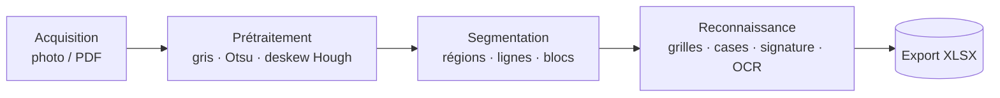

<!-- _paginate: false -->
<!-- _header: "" -->
<!-- _footer: "" -->

# DeepForm
## Correction automatique d'examens semi-structurés

**Projet IG.2405-2026**

Équipe : _[noms à compléter]_
Date : _[à compléter]_

<!-- notes: Slide titre (~30s). Se présenter, annoncer le plan : contexte, méthode, deux programmes, évaluation rigoureuse, résultats honnêtes, perspectives. Insister dès le début sur l'esprit scientifique du projet. -->

---

# Contexte & problème

- **Formulaires semi-structurés** : zones fixes (grilles, cases, signature, cryptogramme) + zones libres (texte manuscrit/imprimé).
- Deux sources d'acquisition, donc **deux programmes** :
  - `autoValidPresences` → feuilles de **présence photographiées** (smartphone).
  - `autoReadForm` → **PDF scannés** de copies d'examen complètes.
- Sortie commune : fichiers **XLSX** exploitables.
- Défi central imposé : **usurpation d'identité** — l'ID coché en grille peut ne pas correspondre au signataire.

<!-- notes: ~1min30. Bien faire comprendre que le sujet n'est pas "lire un QCM" mais un système complet de saisie + un volet sécurité (anti-fraude) sur la signature. Les deux entrées (photo vs scan) ont des qualités très différentes : la photo est bruitée, mal cadrée, éclairage variable. -->

---

# Objectifs — les 3 axes

1. **Présences + signatures** : lire l'ID étudiant, vérifier que la signature appartient bien à cet ID (authentification 1:1).
2. **Lecture de formulaires** : extraire en-tête, cases à cocher, QCM, valeurs numériques, cryptogramme depuis le PDF.
3. **Note** *(hors périmètre du projet)* : le calcul de la note finale n'est pas traité ici, seule l'extraction structurée l'est.

<!-- notes: ~1min. Préciser que l'axe 3 est délibérément hors scope (mentionné dans le cahier des charges) : on fournit la donnée brute structurée, pas le barème. Recentrer le jury sur les axes 1 et 2 qui constituent le cœur technique. -->

---

# Vue systémique — pipeline fonctionnel

- Architecture **modulaire** : `utils/` (briques bas-niveau) + deux programmes orchestrateurs.
- Mêmes briques de prétraitement réutilisées par les deux chaînes.

<!-- notes: ~1min30. Souligner la réutilisation : deskew, preprocess, detect_grid_cells, extract_signature_region sont partagés. La différence photo/PDF se joue surtout au prétraitement et à la robustesse. Montrer que le code suit cette architecture (utils/image_processing.py, grid_reader.py, etc.). -->

---

# Contrainte méthodologique (§4.1)

> **Éléments graphiques = vision bas-niveau uniquement.**

| Élément | Méthode autorisée |
|---|---|
| Grilles, cases à cocher | filtrage, morphologie, taux de remplissage |
| Signatures | HOG, profils, moments de Hu (descripteurs CV) |
| Cryptogrammes | similarité cosinus pixel-à-pixel |
| Redressement | Hough + rotation affine |
| **Texte (champs)** | **OCR / réseaux de neurones autorisés** |

- Conséquence : **aucun réseau** pour grilles/cases/signature/cryptogramme.

<!-- notes: ~1min30. C'est LE point méthodologique à défendre. Le jury vérifiera qu'on n'a pas "triché" en jetant un CNN sur tout. Insister : la signature est traitée par descripteurs CV classiques, pas par un réseau siamois. Seul le texte (Tesseract) utilise de l'OCR. -->

---

# Prétraitement

- **Niveaux de gris** puis lissage gaussien 3×3.
- **Binarisation Otsu** (seuil automatique global) :
$$ k^\* = \arg\max_k \; \sigma_b^2(k) $$
- **Redressement (deskew) par Hough** : détection des lignes, angle = **médiane** des orientations (|angle| < 45°), puis rotation affine.
- Photos : sous-échantillonnage à **2000 px** de haut (mémoire + résolution standard).

<!-- notes: ~1min30. Otsu = maximisation de la variance inter-classes. Hough donne plein de droites ; on prend la médiane des angles pour être robuste aux droites parasites (texte, bords). La rotation utilise BORDER_REPLICATE pour ne pas créer de bandes noires. Garder ça visuel à l'oral, ne pas s'enliser dans les maths. -->

---

# Programme 1 — Lecture de la grille StudentID

- Grille **fixe** : 5 colonnes (chiffres) × 10 lignes (0–9), région calibrée en fractions de l'image.
- Détection des bulles par **contours + k-means** (regroupement en lignes/colonnes) ; repli sur grille régulière + **argmax par colonne**.
- Cas grille de groupe : **suppression morphologique des bordures** de cases (ouverture H puis V) → on ne mesure que les **traits de la croix**.
- Décision par colonne : taux de remplissage **max**, validé s'il dépasse 2× la médiane.

<!-- notes: ~2min. Détail clé : _read_fixed_grid retire les bords des cases par ouverture morphologique horizontale et verticale, puis soustrait ces lignes — il ne reste que le X manuscrit. On évite ainsi que la case vide imprimée soit comptée comme "remplie". argmax par colonne car chaque colonne = un chiffre. -->

---

# Programme 1 — Vérification de signature

- **3 descripteurs** combinés (score pondéré) :
  - **HOG** (histogramme de gradients orientés) — **50 %**
  - **Profils de projection** (horizontal + vertical) — **30 %**
  - **Moments de Hu** (invariants de forme) — **20 %**
- $S = 0.5\,\text{HOG} + 0.3\,\text{Proj} + 0.2\,\text{Hu}$
- Décision **1:1** : accepter si $S \ge \tau$, avec $\tau = 0{,}64$.

**Pourquoi 1:1 plutôt que 1:N ?** On vérifie l'ID *revendiqué* par la grille → détecte l'usurpation. Le 1:N (chercher le meilleur de toute la classe) ne sert que de **repli** si la grille est illisible.

<!-- notes: ~2min30. Point fort. 1:1 = authentification (la signature correspond-elle à l'ID coché ?), c'est exactement ce que demande le défi d'usurpation. 1:N = identification, plus permissif et inadapté à la fraude. NCC abandonné car trop sensible aux déformations des photos ; HOG/Hu sont plus robustes géométriquement. -->

---

# Programme 2 — Lecture des PDF

- **pdf2image à 250 DPI** → une image par page.
- **Cases à cocher** : taux de remplissage intérieur (seuil absolu + relatif à la médiane du groupe).
- **QCM** : cases empilées verticalement par bloc-question, segmentation par lignes de bordure (morphologie), choix = case la plus remplie.
- **Cryptogramme** : **similarité cosinus** pixel-à-pixel entre pages.
- **OCR** (Tesseract + CLAHE + seuil adaptatif) : champs imprimés (module, code, date) **et** manuscrits, valeurs numériques **mantisse / exposant / unité**.

<!-- notes: ~2min. Le PDF est plus propre que la photo → la grille y est très fiable. Les blocs-question sont isolés par leurs bordures horizontales pleines (find_horizontal_lines). OCR seulement sur le texte (conforme §4.1). Corrections post-OCR : _fix_module / _fix_code corrigent les confusions chiffre/lettre fréquentes (1↔I, 6↔G). -->

---

# Méthodologie d'évaluation (§4.2)

- Protocole **train / validation / test strict** = **FORM1 / FORM2 / FORM3**.
- **Vérité terrain automatique** : lue depuis les **noms de fichiers** (aucune annotation manuelle).
- Métrique signature : **balanced accuracy** = moyenne(taux d'acceptation des vraies, taux de rejet des imposteurs).
- Seuil $\tau$ **optimisé sur train**, **confirmé sur validation**, **reporté sur test** (jamais utilisé pour le réglage).
- Paires imposteurs générées en associant chaque signature à un **autre ID** au hasard.

<!-- notes: ~2min. Insister sur la rigueur : le test n'est JAMAIS touché pour le tuning. Train et validation donnent tous deux un optimum à 0,64, d'où le seuil retenu. La balanced accuracy est la bonne métrique car les classes (genuine/impostor) sont équilibrées par construction et le défi porte sur les deux erreurs. -->

---

# Résultats — Grille & signature

**Grille StudentID** (exactitude) :
- TRAIN ≈ **50 %**, VAL ≈ **41 %**, TEST ≈ **52 %**

**Signature — balanced accuracy @ $\tau = 0{,}64$** :
- TRAIN **73 %**, VAL **66 %**, TEST **63 %**
- TPR (vraies acceptées) ≈ **50–59 %**
- TNR (imposteurs rejetés) ≈ **76–88 %**

<!-- notes: ~2min. Être honnête. La grille à ~50% est la limite principale : les photos mal cadrées font dériver les régions calibrées. La signature : on rejette bien les imposteurs (TNR élevé), on est plus prudent sur les vraies (TPR moyen) — compromis volontaire pour la sécurité (mieux vaut refuser une vraie que valider une fraude). -->

---

# Résultats — discussion des chiffres

- Le détecteur de signature **rejette mieux qu'il n'accepte** (TNR ≫ TPR) → choix conservateur, cohérent avec l'objectif anti-fraude.
- **Correction de perspective par équerres en L** explorée (`correct_perspective`) :
  - mappe 4 repères L vers les positions PDF connues.
  - **Non retenue** : photos quasi-frontales → le deskew suffit, le warp **n'améliorait pas** l'exactitude grille en validation.
- Généralisation train→test stable pour la signature (73 → 63 %), pas d'effondrement.

<!-- notes: ~1min30. Montrer qu'on a testé une hypothèse (L-bracket warp) et qu'on l'a écartée sur preuve, pas par flemme — c'est de la démarche expérimentale. Le code reste présent mais désactivé, documenté dans _prepare_image. -->

---

# Discussion critique

**Ce qui marche :**
- Pipeline PDF robuste (binarisation, blocs, cases, cryptogramme cosinus).
- Authentification 1:1 sécurisée (bon rejet des imposteurs).
- Évaluation reproductible, sans annotation manuelle.

**Modes d'échec :**
- Grille sur **photo** : cadrage/éclairage → régions décalées (~50 %).
- **OCR manuscrit** (mantisse/exposant) : chiffres mal formés, faible contraste.
- Signature : peu de **références** par étudiant → descripteurs peu discriminants.

<!-- notes: ~2min. Distinguer clairement les deux régimes : PDF (propre, ça marche) vs photo (bruité, ça pèche). Le maillon faible est la localisation des grilles sur photo, pas la reconnaissance elle-même. Reconnaître les limites est valorisé en soutenance. -->

---

# Perspectives

- **Localisation ancrée sur les rectangles** détectés plutôt que sur des coordonnées relatives fixes (robustesse au cadrage photo).
- **CNN dédié aux chiffres** (manuscrits) pour fiabiliser mantisse/exposant — texte → autorisé par §4.1.
- **Plus de signatures de référence** par étudiant + **augmentation de données** (rotations, élastique).
- Réactiver/améliorer la **correction de perspective** si des photos obliques apparaissent.

<!-- notes: ~1min30. Bien rappeler que le CNN ne porterait QUE sur le texte (chiffres), pas sur les éléments graphiques, pour rester conforme. La piste "ancrage sur rectangles" répond directement au mode d'échec principal identifié au slide précédent. -->

---

# Démo / livrable

- **Notebook Colab autonome** : installe les dépendances, exécute les deux programmes de bout en bout.
- Entrées : dossiers `*_PRESENCES` (photos) et PDF d'examen + `STUDENT_CLASS_SIGNATURES`.
- Sorties : **XLSX** (présences + feuilles PAGE-01 / EXAM) et images de **debug** annotées.
- Script d'évaluation : `optimize_threshold.py` (protocole train/val/test).

<!-- notes: ~1min. Si démo live possible : lancer une présence et montrer la sortie console (grid=… sig=… score=…) + le XLSX. Sinon montrer les images de debug annotées (blocs, cases, marques) générées par exam_page_parser. -->

---

# Conclusion

- Système complet **photo + PDF → XLSX** pour formulaires semi-structurés.
- **Conformité §4.1** : graphique en bas-niveau, OCR réservé au texte.
- Volet **anti-usurpation** par authentification de signature **1:1**.
- Évaluation **scientifique** : train/val/test, balanced accuracy, vérité terrain automatique.
- Résultats honnêtes : PDF fiable, **localisation sur photo** = principal axe de progrès.

<!-- notes: ~1min. Récapituler en une phrase : on a privilégié la rigueur méthodologique et la conformité à la contrainte plutôt que des chiffres gonflés. Le système est modulaire et les pistes d'amélioration sont clairement identifiées et chiffrées. -->

---

<!-- _paginate: false -->

# Merci !
## Questions ?

_Équipe DeepForm — IG.2405-2026_

<!-- notes: Slide final. Garder en tête les questions probables : pourquoi HOG 50% ? (gradient = forme du tracé, le plus discriminant) ; pourquoi pas un réseau siamois ? (interdit §4.1 sur le graphique) ; pourquoi grille à 50% sur photo ? (coordonnées fixes vs cadrage variable). -->
